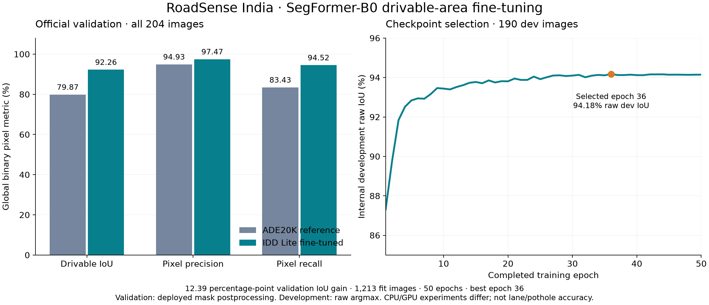

# IDD Lite fine-tuning: completed SegFormer-B0 experiment

Completed on 2026-10-04 in Colab on a Tesla T4. The selected binary checkpoint
achieved **92.26% global drivable-area IoU, 97.47% pixel precision and 94.52% recall**
on every official validation image. This is component-level drivable segmentation,
not lane-marking, pothole, detection, tracking or whole-system accuracy.



## Measured results

| Metric / evidence | Value |
|---|---:|
| Official validation | 204 / 204 images across 61 drive folders |
| Drivable-class IoU | 92.2576596747% |
| Pixel precision | 97.4706971276% |
| Pixel recall | 94.5205069361% |
| True positive / false positive | 4,451,862 / 115,523 pixels |
| False negative / true negative | 258,081 / 9,990,043 pixels |
| Valid / ignored pixels | 14,815,509 / 3,051 |
| Observed / unknown masks | 204 / 0; all predictions retained |
| Completed epochs / selected epoch | 50 / 36 |
| Selected internal raw development IoU | 94.1756200836%; not the official-validation score |
| Optimizer updates / AMP-skipped updates | 7,595 / 5 |

IoU is `TP / (TP + FP + FN)`, precision is `TP / (TP + FP)` and recall is
`TP / (TP + FN)`, summed over valid pixels. These are not mean per-image scores,
background-inclusive mIoU or confidence calibration. Raw IDD Lite level1Id 0
includes road, parking and drivable fallback; raw 1–6 are non-drivable and 255 is ignored.

| Same official validation inputs | Drivable IoU | Pixel precision | Pixel recall |
|---|---:|---:|---:|
| [ADE20K reference](../idd_lite_cpu_20261001/README.md) | 79.87% | 94.93% | 83.43% |
| Binary IDD Lite fine-tuned checkpoint | 92.26% | 97.47% | 94.52% |

The observed IoU gain is **12.39 percentage points**. Input IDs, image/mask hashes,
label grouping and full-frame 512-pixel protocol match. The reference used CPU and
the fine-tuned run used CUDA with different package versions, so this is not a
controlled hardware or isolated-cause ablation. The joint 95/98/95% research
targets were not met; [target checks](targets_result.json) retain the failures.

## Fixed training and evaluation protocol

| Choice | Recorded setting |
|---|---|
| Fit / internal development / official validation | 1,213 / 190 / 204 images; 263 / 46 / 61 drive folders |
| Split controls | Seed 42; drive folders disjoint; exact encoded/decoded-image duplicate checks |
| Initialization | ADE20K SegFormer-B0 revision `489d5cd81a0b59fab9b7ea758d3548ebe99677da` |
| Head / input | Two classes; RGB 512×512; native 320×227 supervision |
| Optimization | AdamW, learning rate 6e-5, weight decay .01, batch 8, 50 epochs |
| Schedule / loss | 5% warmup + cosine; ignore-aware CE + .5 soft drivable Dice |
| Numerics | CUDA FP16 forward; FP32 interpolation/loss; nonfinite AMP updates skipped, scheduler preserved |
| Selection | Internal raw development metrics only; maximum IoU when joint targets unmet |
| Official evaluation | Separate complete-frame run; class 1; deployed interpolation/morphology/component/coverage postprocessing |
| Environment | Tesla T4; Python 3.13.15; Torch 2.11.0+cu130; Transformers 4.57.6; NumPy 2.1.3 |

No official-validation inference or checkpoint selection occurred during training.
The official split had already been inspected in the earlier baseline experiment,
so it is previously observed validation, not an untouched final test. Folder and
exact-duplicate checks do not establish geographic independence.

## Check the evidence without a GPU

```bash
python scripts/audit_accuracy_report.py --report benchmarks/idd_lite_finetuned_20261004/official_val_result.json --manifest benchmarks/idd_lite_finetuned_20261004/sample_index.json
python -m pytest -q tests/test_finetuned_accuracy_evidence.py
python scripts/plot_drivable_results.py
```

| Artifact | Purpose |
|---|---|
| [Original result](official_val_result.json) | Unchanged aggregate and all 204 per-image records; actual environment and source hashes |
| [Original manifest](official_val_manifest.json), [portable index](sample_index.json) | Frozen inputs; portable copy changes only dataset-root paths |
| [Training splits](training_splits.json), [protocol](protocol.json) | Fixed train/development/validation identities and recipe; no images or masks |
| [History](history.json), [selection](best_selection.json), [summary](training_summary.json) | Every completed epoch and development-only selection |
| [Training log](training.log), [numerical events](numerical_events.jsonl), [CUDA regression](cuda_regression.json) | Completed run and AMP overflow/recovery evidence |
| [Audit](audit.json), [provenance](provenance.json) | Identity/arithmetic checks and published artifact SHA-256 values |
| [Measured source](measured_source.tar.gz) | Exact recorded evaluator/source and executed trainer; no model weights or dataset files |

`training_summary.json` retains `official_val_metrics: null` because it was written
before separate evaluation. The official scores come from `official_val_result.json`,
not a rewritten training summary. The audit checks counts/identities; it is not a
second inference run or an annotation-quality review.

| Identity | SHA-256 |
|---|---|
| Selected weights | `1cf44872753e3231540324da9871d598d0687b0be43d2126026e560cbb3061d1` |
| Frozen training manifest | `1e30c0de0df837c0bb615b4b5ed7a42e5132e5c18a2733409bfe92b8e47433da` |

## Reproduce with licensed data and weights

Obtain IDD Lite through its official portal and accept its licence. Dataset
imagery, labels and selected weights are not public artifacts in this repository.
An exact new inference reproduction therefore needs the privately retained selected
checkpoint with the recorded hash. A fresh 50-epoch training run can produce a
different checkpoint/score; seeds do not guarantee bit-identical GPU training.

The [training guide](../../docs/DRIVABLE_TRAINING.md) explains a new run. For exact
historical source, extract `measured_source.tar.gz` into a separate directory; the
current evaluator adds independent-test contract checks after this measurement.
Use the original manifest in the matching Colab path, or put the portable index
next to an extracted `idd20k_lite` dataset root so its relative paths resolve.
Configure the local selected `best` checkpoint with class 1 and a full-frame ROI;
any path change needs a newly recorded configuration hash.

## Evidence → finding → next validation

| Evidence | Supported finding | Next validation |
|---|---|---|
| Complete history, split manifest and selected weight hash | A controlled 50-epoch binary fine-tuning run completed | Replicate training as a separately named experiment |
| Complete official report, input identities and arithmetic audit | 92.26% deployed drivable-class IoU on this validation protocol | Independent human-labelled road sessions |
| Separate raw development and deployed validation records | Checkpoint selection and validation are distinct | Error/slice analysis without tuning on test predictions |

The path is frozen split → training → development selection → checkpoint/configuration
freeze → complete official validation → arithmetic/hash audit. The separate 40-frame
new-road pilot has no reviewed labels or metrics yet. Fine-tuned full-pipeline FPS,
lane/pothole accuracy and vehicle safety remain unmeasured.
